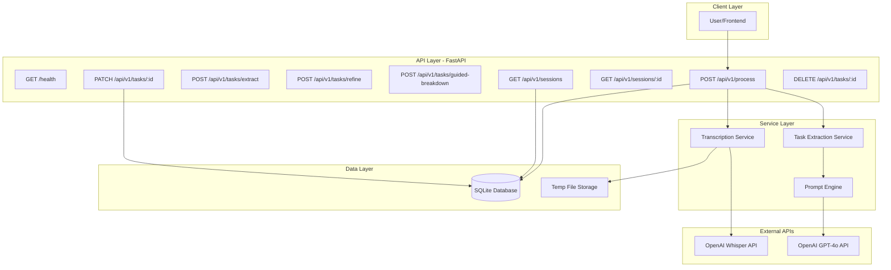
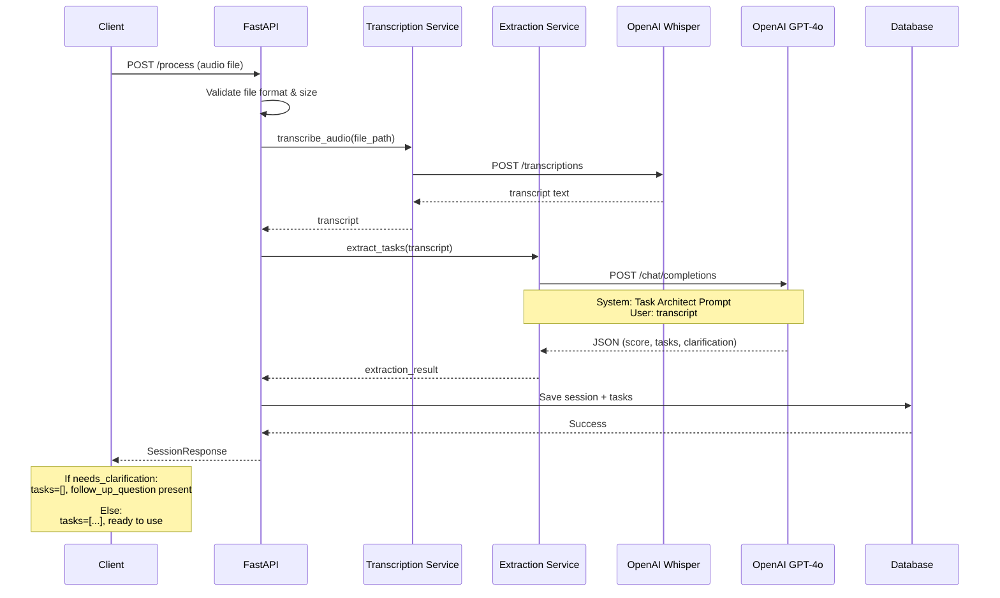
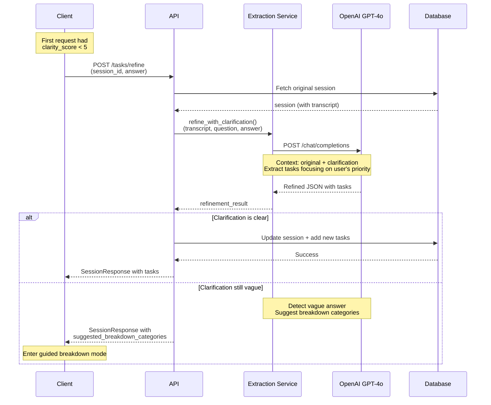
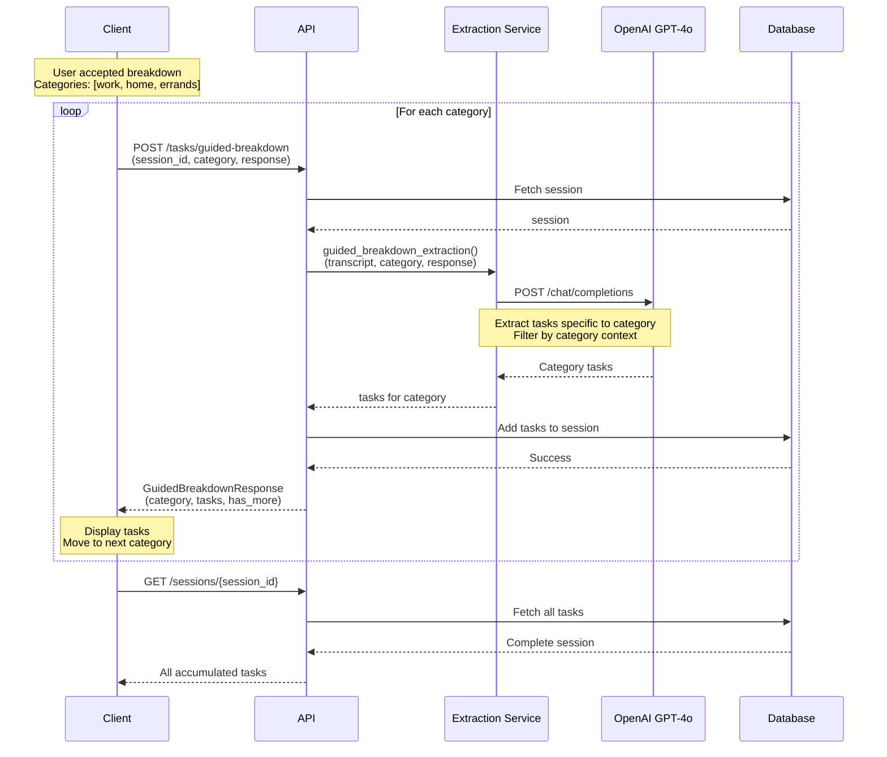
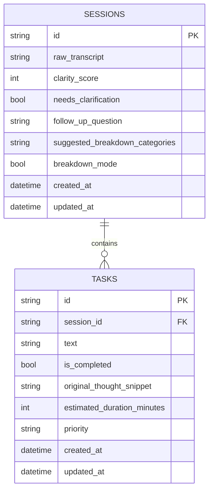
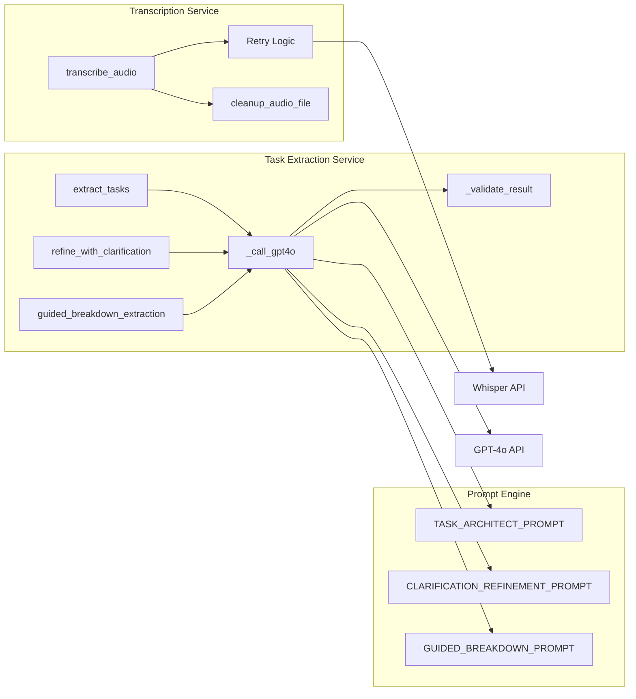
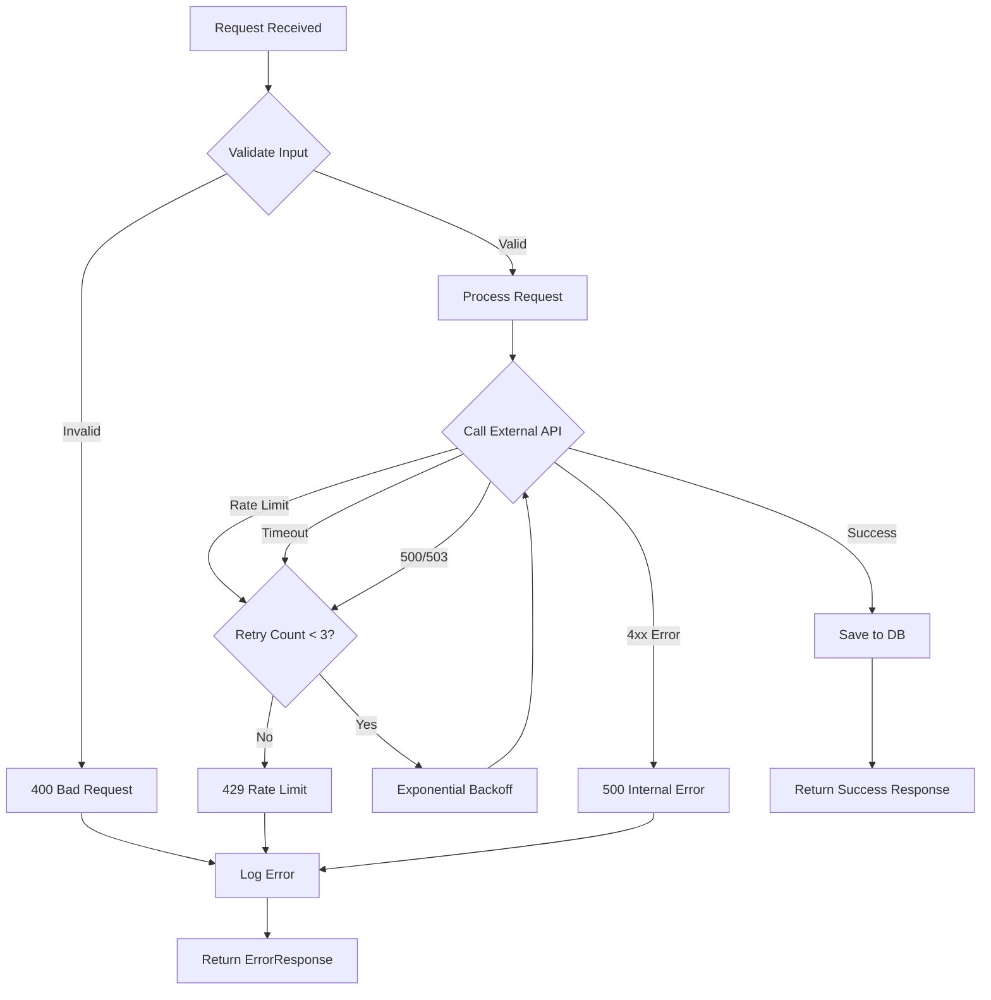
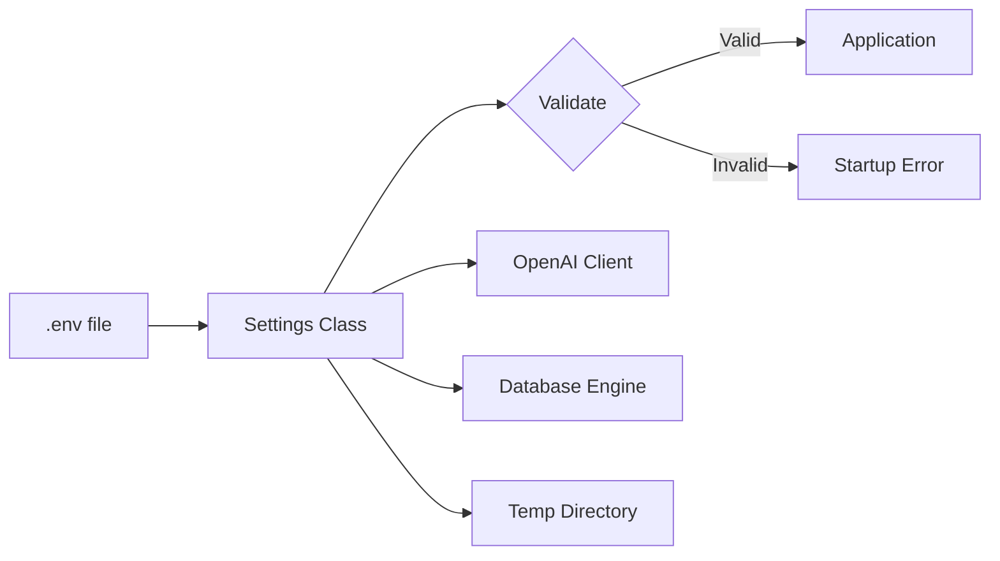

# ClarityVoice Architecture

## System Overview



## Request Flow: Main Endpoint



## Clarification Flow



## Guided Breakdown Flow (New)



## Data Model



## Service Architecture



## Error Handling Flow



## File Organization

```
Project-Important/
│
├── main.py                 ← FastAPI app, startup logic
├── config.py              ← Settings, env vars, validation
│
├── api/                   ← HTTP layer
│   ├── endpoints.py       ← Route handlers (8 endpoints)
│   └── dependencies.py    ← Global error handling
│
├── services/              ← Business logic
│   ├── transcription.py   ← Whisper integration + retry
│   ├── task_extraction.py ← GPT-4o integration + validation
│   └── prompts.py         ← System prompts for LLM
│
├── models/                ← Data models
│   ├── database.py        ← SQLModel ORM (sessions, tasks)
│   └── schemas.py         ← Pydantic request/response
│
└── tests/                 ← Test suite
    ├── test_transcription.py
    ├── test_extraction.py
    └── test_endpoints.py
```

## Component Responsibilities

### API Layer (api/)
- Route definitions
- Request/response handling
- Input validation
- Exception handling
- HTTP status mapping

### Service Layer (services/)
- External API integration
- Business logic
- Retry mechanisms
- Data transformation
- Prompt management

### Model Layer (models/)
- Database schema
- ORM mappings
- Request/response contracts
- Data validation

### Test Layer (tests/)
- Unit tests for services
- Integration tests for endpoints
- Mock external APIs
- Test fixtures

## Configuration Management



## Deployment Considerations

### Current State (MVP)
- Single-server deployment
- SQLite database (file-based)
- Local file storage for audio
- No horizontal scaling

### Future Enhancements
- PostgreSQL for multi-server
- S3/Cloud Storage for audio
- Redis for caching
- Load balancer support
- Background job queue

## Security Model

### Current (MVP)
- No authentication
- Local development only
- CORS enabled for localhost

### Future
- JWT authentication
- User-specific sessions
- Rate limiting per user
- API key rotation
- Audit logging
